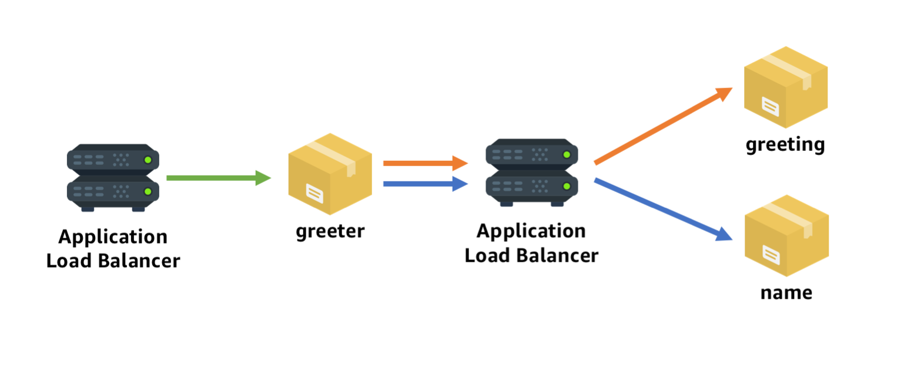

# greeter-cdk

A simple [AWS Cloud Development Kit](https://github.com/awslabs/aws-cdk) app example that shows how to deploy a microservice stack using the following example microservice containers:

* [nathanpeck/greeter](https://hub.docker.com/r/nathanpeck/greeter/) - Constructs a random greeting phrase from a greeting and a name.
* [nathanpeck/greeting](https://hub.docker.com/r/nathanpeck/greeting/) - Returns a random greeting
* [nathanpeck/name](https://hub.docker.com/r/nathanpeck/name/) - Returns a random name

The microservices are connected like this:

* A public facing load balancer distributes traffic from the general public to the front facing `greeter` service.
* The `greeter` services uses a private, internal application load balancer to fetch from the `greeting` and `name` services, which are bound to the paths `/greeting` and `/name` on the ALB.

You can see the full CDK app that deploys this architecture here: [index.js](/index.js)
